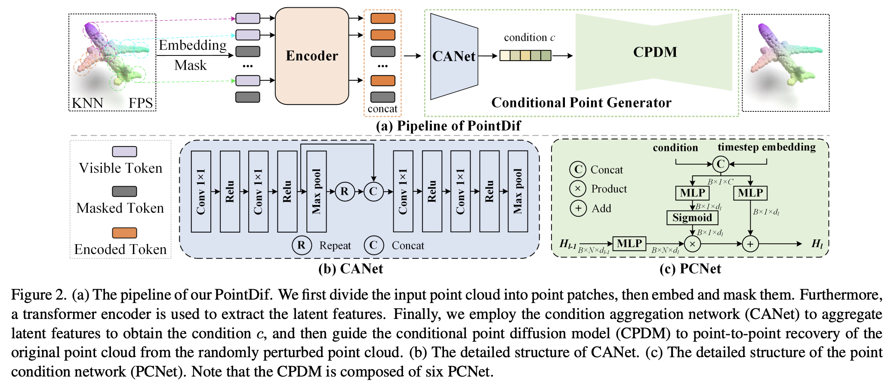

# PointDif

## Point Cloud Pre-training with Diffusion Models [CVPR2024](https://openaccess.thecvf.com/content/CVPR2024/papers/Zheng_Point_Cloud_Pre-training_with_Diffusion_Models_CVPR_2024_paper.pdf)


We propose the first framework for point cloud pre-training based on diffusion models, called PointDif.

<div  align="center">    
 
</div>


## 1. Installation
PyTorch >= 1.10.0;
python >= 3.7.12;
CUDA >= 11.1;

```
pip install -r requirements.txt
```

```
# PointNet++
pip install "git+https://github.com/erikwijmans/Pointnet2_PyTorch.git#egg=pointnet2_ops&subdirectory=pointnet2_ops_lib"

# GPU kNN
pip install --upgrade https://github.com/unlimblue/KNN_CUDA/releases/download/0.2/KNN_CUDA-0.2-py3-none-any.whl

# SoftPool
git clone https://github.com/alexandrosstergiou/SoftPool.git
cd SoftPool-master/pytorch
make install
```

## 2. Data Preparation

We use ShapeNet, ScanObjectNN, ScanNet, S3DIS, SemanticKITTI in this work. See [DATASET.md](./DATASET.md) for details.

## 3. Pre-trained Models
The pretrained model is available at: 
[ [Baidu Netdisk](https://pan.baidu.com/s/1p1gDTkuf7Ys0zBYVsP9aSA?pwd=tw43) ] (code : tw43)


## 4. PointDif pre-training

Run the following command to pre-train the PointDif model on ShapeNet:
```
CUDA_VISIBLE_DEVICES=<GPUs> python pointdif_main.py --config cfgs/pretrain.yaml --exp_name <output_file_name>
```

## 5. PointDif fine-tuning
Run the following command to fine-tunine the PointDif model on ScanObjectNN:
```
CUDA_VISIBLE_DEVICES=<GPUs> python pointdif_main.py --config cfgs/finetune_scan_hardest.yaml \
--finetune_model --exp_name <output_file_name> --ckpts <path/to/pre-trained/model>
```

## 6. Acknowledgements

Our codes are built upon [Point-MAE](https://github.com/Pang-Yatian/Point-MAE/tree/main).

## 7. Citation
If you find PointDif useful to your research, please cite our work.
```
@inproceedings{zheng2024point,
  title={Point Cloud Pre-training with Diffusion Models},
  author={Zheng, Xiao and Huang, Xiaoshui and Mei, Guofeng and Hou, Yuenan and Lyu, Zhaoyang and Dai, Bo and Ouyang, Wanli and Gong, Yongshun},
  booktitle={Proceedings of the IEEE/CVF Conference on Computer Vision and Pattern Recognition},
  pages={22935--22945},
  year={2024}
}
```